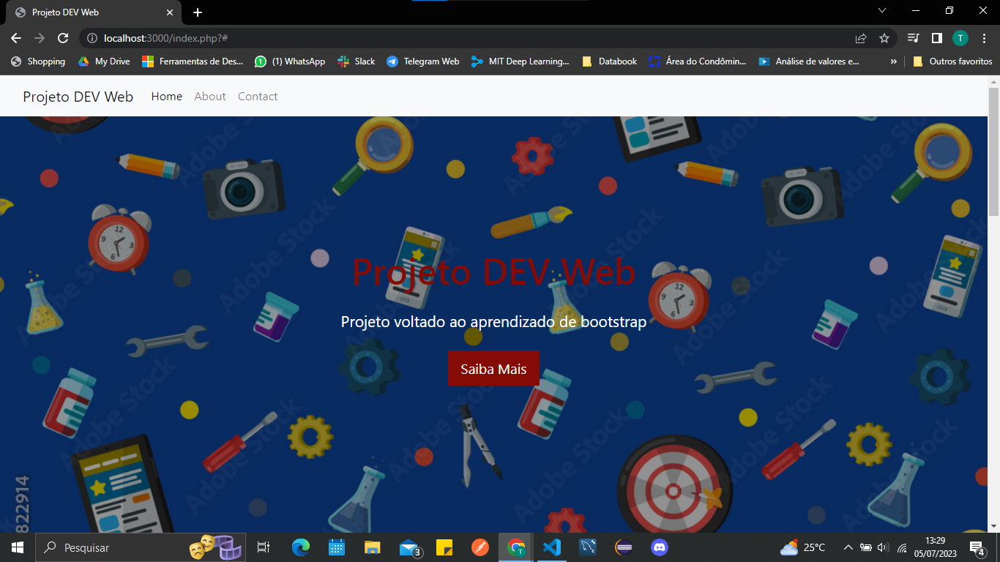

# Projeto WEB Dev

## Descrição do Projeto

Projeto consiste na criação de uma home page utilizando o [Bootstrap](https://getbootstrap.com/) com [PHP](https://www.php.net/).

Projeto retirado do curso [PHP Jedai](https://cursos.dankicode.com/php-jedai).

Qualquer dúvida pode me contatar pelo [LinkedIn](https://www.linkedin.com/in/taylan-torres/).

## Descrição
### Executar localmente:
- Para clonar o projeto: git clone https://github.com/TaylanTorres09/bookstore-front.git
- Para Executar o projeto precisasse:
    -[PHP](https://www.php.net/) instalado e configurado na variável de ambiente do windows.
    -[VsCode](https://code.visualstudio.com/) como interpretador de código.
    -[PHP Server](https://marketplace.visualstudio.com/items?itemName=brapifra.phpserver) para iniciar servidor.

- Depois de instalados **EXECUTAR** pressione as teclas ctrl+shift+p e aparecerá a janela abaixo:

digite ***PHP Server: Serve Project*** e selecione a opção.

#### Home - Clique em imagem e será redirecionado para vídeo.

## Próximos Passos
- Implementar Back End.
- Fazer Deploy.
## Autor
 